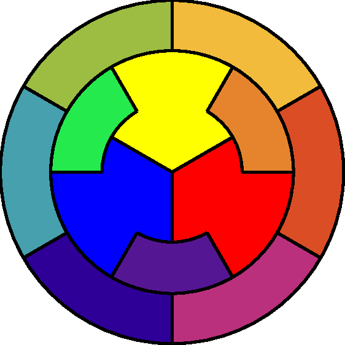

# Cercle chrosmatique

Ce cercle chromatique réorganise celui de Johannes Itten : les six couleurs tertiaires occupent la grande couronne, les trois couleurs secondaires la couronne intérieure et les trois couleurs primaires le centre. Graphiquement, chaque couleur tertiaire est composée d’une couleur primaire et d’une couleur secondaire, et chaque couleur secondaire est composée de deux primaires. La représentation graphique est ainsi simplifiée pour offrir une vue d’ensemble claire de l’organisation des douze couleurs principales.

## Open source
    Licence : [GPL v3](https://www.gnu.org/licenses/gpl-3.0.html "GNU")
    Code source : https://github.com/YannickHiou/cercle_chromatique

Note sur le logo :*
Le code de cette application est sous licence GPL v3.
Le logo "CercleChromatique" reste la propriété de Yannick Hiou
et n'est pas couvert par la GPL v3. Son utilisation nécessite
une autorisation explicite.
