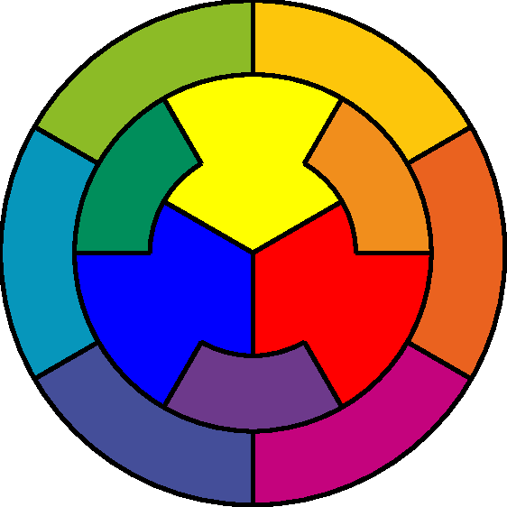
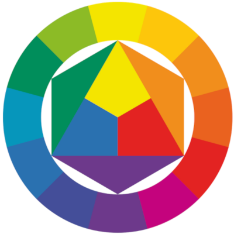
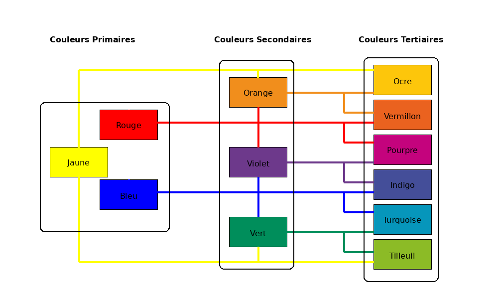

# Cercles chromatiques

Ce cercle chromatique réorganise celui de Johannes Itten : les six couleurs Tertiaires occupent la grande couronne extérieure, les trois couleurs Secondaires la couronne intérieure et les trois couleurs Primaires le centre. Chaque couleur Tertiaire est composée de deux couleurs dont une Primaire et une Secondaire, et chaque couleur Secondaire est composée de deux Primaires. La représentation graphique est ainsi simplifiée pour offrir une vue d'ensemble claire de l'organisation des douze couleurs principales avec une lecture directe des six couleurs Tertiaires.

Je partage ce cercle chromatique que j'ai créé pour des besoins pédagogiques personnels.


<div style="display:flex; gap:10px; justify-content:center;">
  
  
</div>

<div style="display:flex; gap:10px; justify-content:center;">
  
</div>


## Commentaire
Les images sont produites à l’aide d'une table de couleurs et de trois paramètres Rt, Rs et Rp, qui sont respectivement les rayons des cercles concentriques séparant les zones de couleurs Tertiaires, Secondaires et Primaires.  
La configuration originale fixe Rt à 200, et fixe Rs et Rp de sorte que la surface des couleurs Tertiaires soit trois fois celle des couleurs Primaires et que la surface des couleurs Secondaires alternées soit deux fois celle des couleurs Primaires.
Cette répartition des surfaces contribue à un certain équilibre du dessin.

## Ligne de Commandes

#### Clonner le projet

```
git clone git@github.com:YannickHiou/cercle_chromatique.git
cd cercle_chromatique

```

#### Librairies à importer

```
pip install Pillow PyYAML

```

#### Générateur de cercles chromatiques

```
puthon3 yannick.hiou.py

```
#### ou
```

python3 yannick.hiou.py  --Rs 100 --Rp 50
```

## Open source
    Licence : GPL v3 [https://www.gnu.org/licenses/gpl-3.0.html]

    Les images sont libres pour les usages non commerciaux et soumises à EULA pour les usages commerciaux s'il devait y en avoir