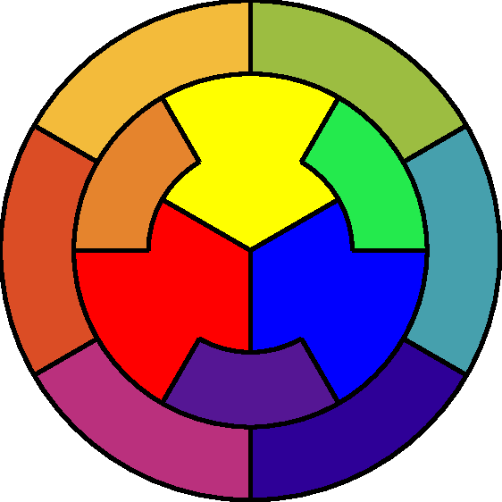

# Cercles chromatiques

Ce cercle chromatique réorganise celui de Johannes Itten : les six couleurs tertiaires occupent la grande couronne, les trois couleurs secondaires la couronne intérieure et les trois couleurs primaires le centre. Graphiquement, chaque couleur tertiaire est composée d’une couleur primaire et d’une couleur secondaire, et chaque couleur secondaire est composée de deux primaires. La représentation graphique est ainsi simplifiée pour offrir une vue d’ensemble claire de l’organisation des douze couleurs principales.

  

## Open source
    Licence : GPL v3 [https://www.gnu.org/licenses/gpl-3.0.html]
    

Note sur les images :*
Le code de ce programme est licencié sous la GNU GPL v3.

Les images produites par ce programme ne sont pas couvertes par la licence GPL v3. Ces images restent la propriété de Yannick Hiou et sont protégées par un contrat de licence utilisateur final (EULA) distinct. Toute utilisation, reproduction, distribution, modification ou exploitation commerciale de ces images requiert une autorisation explicite conformément aux termes de cette EULA.